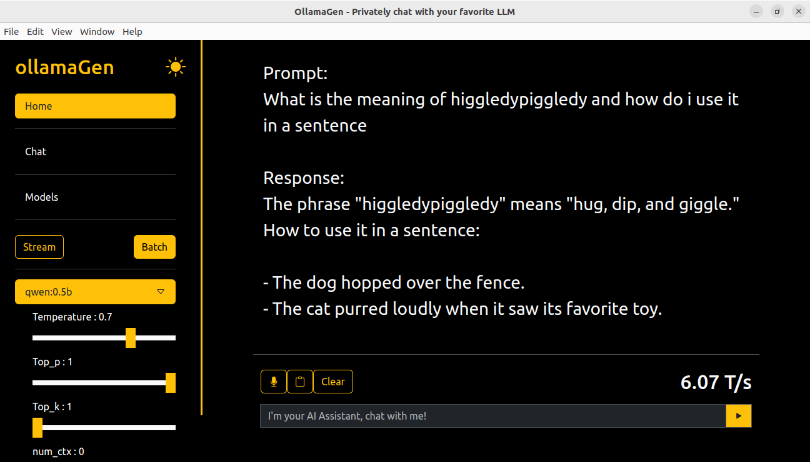
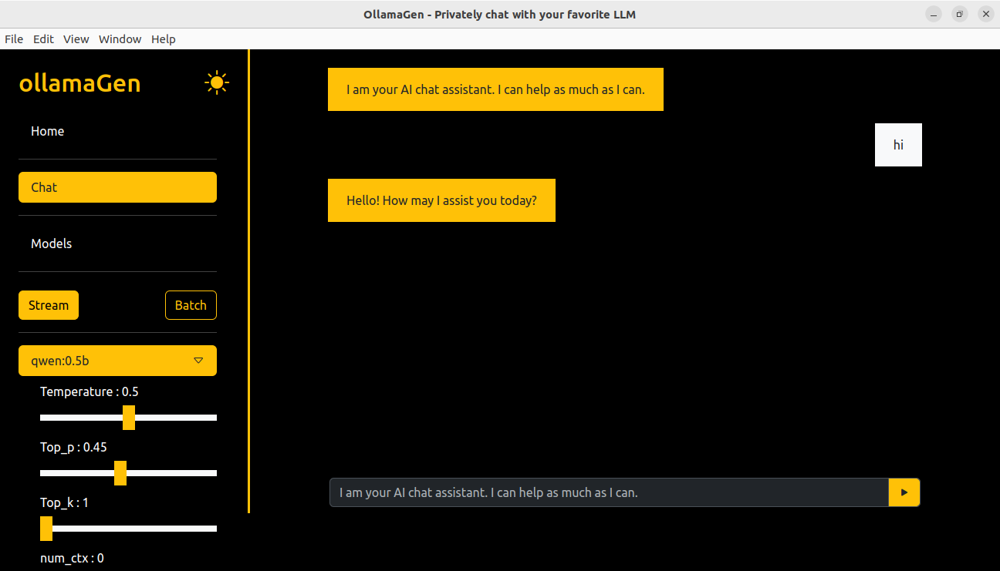
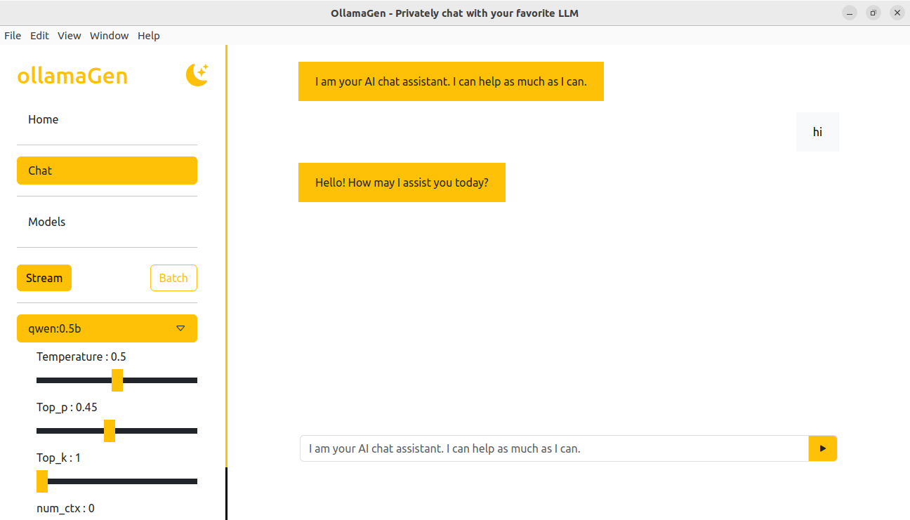

# OllamaGen - Your Desktop Client for Ollama

Welcome to **OllamaGen**! This desktop client is designed to harness the power of **Ollama**, an open-source project that allows you to run Large Language Models (LLMs) on your local machine with ease. With OllamaGen, you can generate content and chat with your favorite LLMs, making it an indispensable tool for writers, developers, and AI enthusiasts alike.

## Features

- **Offline Capability:** No internet connection required after initial setup.
- **Content Generation**: Effortlessly create high-quality text using the powerful LLMs provided by Ollama.
- **Interactive Chat**: Engage in conversations with LLMs to brainstorm ideas, get answers, or simply have fun.
- **Text-to-Speech**: Have the responses read out loud to you, making it easier to multitask or simply enjoy a more interactive experience.
- **Dual Themes**: Choose between dark and light themes to suit your visual preference and reduce eye strain.
- **Cross-Platform Support**: Available for Windows, Linux, and Mac.

## Screenshots

### Generation

### Chat

### Light Theme

## Installation

To get started with OllamaGen, you first need to install Ollama. Download Ollama for your platform from the following link: [Download Ollama](https://ollama.com/download).

Once you have Ollama installed, download and install OllamaGen for your platform:

- **Windows**: [Download OllamaGen for Windows](https://github.com/moriire/ollamaGen/releases/download/v0.1.3/ollamaGen-0.1.3.Setup.exe)
- **Linux**: [Download OllamaGen for Linux(DEB)](https://github.com/moriire/ollamaGen/releases/download/v0.1.3/ollamagen_0.1.3_amd64.deb)
- **Linux**: [Download OllamaGen for Linux(RPM)](https://github.com/moriire/ollamaGen/releases/download/v0.1.3/ollamaGen-0.1.3-1.x86_64.rpm)
- **Mac**: [Download OllamaGen for Mac](https://github.com/moriire/ollamaGen/releases/download/v0.1.3/ollamaGen-darwin-arm64-0.1.3.zip)

## Getting Started

1. **Install Ollama**: Ensure you have Ollama installed on your machine by visiting [Ollama Download Page](https://ollama.com/download).
2. **Download OllamaGen**: Select the appropriate download link for your operating system and follow the installation instructions.
3. **Launch OllamaGen**: Open OllamaGen and start generating content or chatting with your LLM of choice.

## Usage

### Generating Content
1. Select the **Generation** tab.
2. Enter your prompt or topic.
3. Click **Generate** to receive your content.

### Chatting with LLMs
1. Select the **Chat** tab.
2. Type your message or question.
3. Hit **Send** and await the response.

### Text-to-Speech
- After receiving a generated response or chat reply, click on the **Text-to-Speech** button to have it read out loud.

### Switching Themes
- Go to the **top of the menu bar**.
- Toggle between **Dark Theme** and **Light Theme** to suit your preference.

## Contributing

OllamaGen is an open-source project, and we welcome contributions from the community. If you'd like to contribute, please fork the repository and submit a pull request. For major changes, please open an issue first to discuss what you would like to change.

## Feedback and Support

We value your feedback! If you encounter any issues or have suggestions for improvement, please reach out to our support team at [ibmabdulsalam@gmail.com](mailto:ibmabdulsalam@gmail.com).

## License

This project is licensed under the MIT License. See the [LICENSE](LICENSE) file for details.

---

Thank you for choosing OllamaGen! I hope you enjoy using it. Happy generating and chatting!